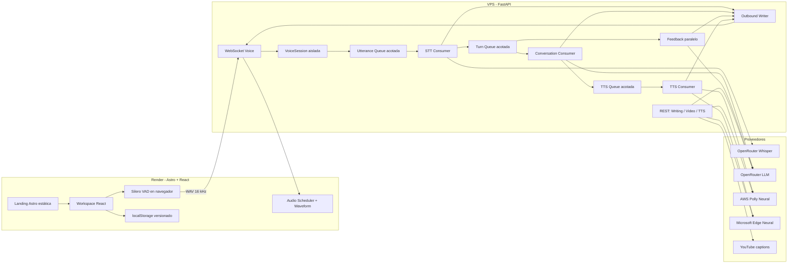

# VSLingo — Especificación de producto y decisiones técnicas

> **The Code-Editor Interface for Mastering Developer English.**

[Volver al README](../README.md)

Este documento reúne las decisiones persistentes aprobadas para la Alpha de VSLingo. Define el producto objetivo, sus contratos y sus restricciones; el orden de implementación y el estado de ejecución se documentan por separado.

## 1. Producto, audiencia y principios

VSLingo es una plataforma de práctica de inglés para desarrolladores hispanohablantes. Su filosofía es **«al grano, sin ruido»**: práctica profesional, directa y sin mecánicas de gamificación infantil.

- La interfaz y las explicaciones estarán en español.
- Las conversaciones, correcciones y el vocabulario estarán en inglés B1-B2.
- La experiencia se presentará como una herramienta profesional para comunicación técnica, no como una copia literal de VS Code.
- Se podrá probar la aplicación sin registro.
- Se protegerá el presupuesto sin introducir autenticación.
- Voice Studio será la experiencia diferenciadora prioritaria.
- Writing Studio y Video Lab se mantendrán pequeños, funcionales y fiables.
- Se evitará el código huérfano: cada incremento deberá quedar integrado y demostrable.
- Las funciones y clases del backend se mantendrán documentadas y con contratos tipados.

## 2. Objetivos y alcance de la Alpha

La Alpha tiene como objetivo entregar tres módulos funcionales:

1. **Voice Studio:** conversación por voz en tiempo real con feedback.
2. **Writing Studio:** corrección estructurada de inglés.
3. **Video Lab:** reproducción de vídeos de YouTube con transcripción sincronizada.

### 2.1 Incluido

- Landing estática en Astro con CTA **«Probar demo»**.
- Workspace interactivo en React 19.
- Interfaz y explicaciones en español.
- Conversaciones, correcciones y vocabulario en inglés B1-B2.
- Voice Studio con cuatro escenarios:
  - Daily Standup.
  - System Design / Technical Interview.
  - Salary Negotiation.
  - Libre / Explorar.
- VAD automático, interrupción del asistente y push-to-talk de respaldo.
- STT mediante OpenRouter Whisper.
- LLM mediante OpenRouter.
- TTS seleccionable entre AWS Polly Neural y Microsoft Edge Neural mediante `edge-tts`.
- Estado reciente y preferencias en `localStorage` versionado.
- Límites técnicos, observabilidad de latencia y seguimiento de costos.
- Pruebas unitarias, de integración, de contratos de proveedores y E2E.

### 2.2 Fuera del alcance

- Clerk o cualquier autenticación.
- Stripe, planes y billing.
- Base de datos e historial entre dispositivos.
- Glosarios y ejercicios avanzados de Video Lab.
- Modos especializados Slack/PR/email en Writing Studio.
- Evaluación fonética detallada de pronunciación.
- Safari y móviles como navegadores certificados.
- Redis, múltiples workers o escalado horizontal.
- Pricing definitivo.

El diseño deberá ser responsive, pero eso no convierte a móviles en plataforma certificada para esta Alpha.

## 3. Requisitos funcionales por módulo

### 3.1 Writing Studio

- Los contratos de corrección serán tipados.
- Un `CorrectionService` asíncrono coordinará la corrección.
- El adaptador de OpenRouter solicitará salida estructurada con JSON Schema.
- La interfaz incluirá editor, diff categorizado, feedback y acciones para copiar y limpiar.
- El estado reciente se conservará localmente.
- Una corrección podrá reproducirse mediante cualquiera de los dos proveedores TTS.
- Los modos especializados para Slack, pull requests o email no forman parte de la Alpha.

### 3.2 Video Lab

- El parser de URL de YouTube y el proveedor de transcripciones estarán separados.
- Se intentará obtener una transcripción inglesa directa o una traducción cuando corresponda.
- Los fallos del proveedor se mapearán a errores específicos y accionables.
- La interfaz ofrecerá transcripción sincronizada, seek, vistas de párrafo y línea, biblioteca y notas locales.
- Se incluirá un vídeo técnico de muestra con una transcripción incorporada para garantizar un recorrido estable.
- Los glosarios y ejercicios avanzados quedan fuera del alcance.

### 3.3 Voice Studio

- Los escenarios serán Daily Standup, System Design / Technical Interview, Salary Negotiation y Libre / Explorar.
- Cada escenario tendrá su propio prompt.
- El modo Libre no impondrá contexto técnico obligatorio.
- El historial conversacional será acotado.
- La conversación se generará en streaming y el feedback estructurado se generará en paralelo.
- Un fallo del feedback no bloqueará ni invalidará la respuesta conversacional.
- La interfaz mostrará respuesta, diff, vocabulario y resumen.
- Push-to-talk seguirá disponible como respaldo si el VAD no puede inicializarse.

### 3.4 TTS compartido

- Writing Studio y Voice Studio compartirán la abstracción `SpeechSynthesizer`.
- Los adaptadores serán AWS Polly Neural y Microsoft Edge Neural mediante `edge-tts`.
- Ambos producirán MP3 con contrato `audio/mpeg`.
- El proveedor será seleccionable y la preferencia será persistente.
- No habrá fallback silencioso entre proveedores.

### 3.5 Estado local

El estado reciente, la biblioteca, las notas y las preferencias se almacenarán en `localStorage` versionado, con migraciones cubiertas por pruebas. No habrá sincronización entre dispositivos ni base de datos en esta etapa.

## 4. Stack, arquitectura y estructura objetivo

### 4.1 Stack e infraestructura

| Capa | Tecnología | Despliegue | Responsabilidad |
| --- | --- | --- | --- |
| Landing | Astro | Render Static Site | SEO, contenido y entrada a la demo |
| Workspace | React 19 + Tailwind CSS v4 | Render Static Site | UI interactiva y audio del navegador |
| Backend | FastAPI + Python 3.11+ | VPS propio | REST, WebSocket y orquestación asíncrona |
| STT | OpenRouter Whisper | OpenRouter / Groq | Transcripción de segmentos de voz |
| LLM | Modelo rápido configurable | OpenRouter | Conversación y feedback estructurado |
| TTS principal | AWS Polly Neural | AWS | Síntesis oficial para la hackathon |
| TTS alternativo | `edge-tts` | Servicio online de Microsoft Edge | Voz alternativa seleccionable |
| Vídeo | `youtube-transcript-api` | VPS / YouTube | Obtención de subtítulos disponibles |

El frontend será una sola aplicación Astro: la landing se renderizará de forma estática y `/demo` montará el workspace React. La landing será mayormente libre de JavaScript y Voice Studio se cargará únicamente al solicitarlo.

El backend será un monolito modular; no se usarán microservicios en esta etapa. FastAPI tendrá app factory, configuración tipada y puertos explícitos para proveedores. La falta de credenciales de una integración opcional no impedirá arrancar la aplicación ni consultar health. Los proyectos tendrán lockfiles y comandos uniformes para una entrega reproducible.

### 4.2 Arquitectura aprobada



### 4.3 Estructura objetivo del repositorio

```text
vslingo/
├── frontend/
│   ├── src/pages/index.astro
│   ├── src/pages/demo.astro
│   ├── src/components/landing/
│   ├── src/features/writing/
│   ├── src/features/video/
│   ├── src/features/voice/
│   ├── src/shared/
│   └── tests/
├── backend/
│   ├── app/api/
│   ├── app/core/
│   ├── app/domain/
│   ├── app/providers/
│   ├── app/services/
│   ├── app/voice/
│   ├── app/prompts/
│   └── tests/
├── deploy/
└── README.md
```

## 5. Proveedores y decisiones técnicas aprobadas

### 5.1 OpenRouter Speech-to-Text

OpenRouter expone el endpoint dedicado:

```text
POST https://openrouter.ai/api/v1/audio/transcriptions
```

Modelos confirmados:

- Predeterminado: `openai/whisper-large-v3-turbo`, servido por Groq.
- Alternativo configurable: `openai/whisper-large-v3`, servido por Groq o Together.

El endpoint admite WAV, WebM, MP3 y otros formatos. Devuelve `usage.seconds` y `usage.cost`, que serán la fuente autoritativa para telemetría y costos.

La Alpha utilizará Turbo por latencia y costo. V3 será una opción de configuración, no un fallback automático.

### 5.2 OpenRouter LLM

Se usará un modelo rápido configurable de OpenRouter para conversación, chat en streaming, corrección y feedback estructurado. Writing solicitará JSON Schema; Voice separará la conversación en streaming del feedback estructurado para que este último no bloquee el inicio de la respuesta hablada.

### 5.3 TTS y nomenclatura

`edge-tts` usa el servicio online de Microsoft Edge. No es el SDK oficial de Azure Speech. La UI lo presentará como **Microsoft Edge Neural** para no declarar una integración inexistente.

AWS Polly será la integración oficial destacada. Ambos adaptadores producirán `audio/mpeg` y compartirán el mismo contrato. Motor, voz, límites, MIME, timeout y cancelación formarán parte explícita del contrato; un proveedor inválido producirá un error y no un fallback silencioso.

### 5.4 YouTube

`youtube-transcript-api` utiliza una API no documentada. La extracción real será de mejor esfuerzo y se complementará con caché LRU temporal, errores específicos y accionables, y un vídeo técnico de muestra con transcripción incluida. No se usarán proxies residenciales dentro del alcance inicial.

### 5.5 Comportamiento común de proveedores

- Los clientes de red serán asíncronos.
- Los proveedores tendrán timeouts, reintentos acotados y errores normalizados.
- Los adaptadores se aislarán detrás de puertos para poder sustituirlos por falsos en pruebas.
- Las pruebas normales no consumirán APIs pagas; las comprobaciones live serán opt-in.

## 6. Voice Pipeline, concurrencia y cancelación

### 6.1 Principios adaptados de la referencia

La referencia [`speech-to-speech`](../../references/speech-to-speech) implementa VAD → STT → notificador → LLM → procesador → TTS con threads y modelos locales. VSLingo reutilizará sus principios, no su implementación literal:

- Mensajes tipados.
- Aislamiento completo por sesión.
- Identificadores de turno.
- Cancelación mediante generaciones.
- Descarte de respuestas y audio obsoletos.
- Apagado limpio.
- Métricas por etapa.

VSLingo utilizará `asyncio.TaskGroup`, clientes HTTP asíncronos y colas acotadas por WebSocket. No necesita turnos especulativos complejos porque el VAD del navegador entrega segmentos finales.

### 6.2 VAD en navegador

`@ricky0123/vad-web` ejecutará Silero VAD localmente y entregará audio mono a 16 kHz. Esto permitirá:

- Detectar inmediatamente cuándo el usuario empieza a hablar.
- Detener la reproducción local antes de esperar al servidor.
- Enviar solo el segmento hablado.
- Reducir ancho de banda y CPU del VPS.
- Conservar push-to-talk si VAD no puede inicializarse.

Los assets ONNX, WASM y AudioWorklet se servirán desde el propio frontend. El paquete se importará dinámicamente solo al entrar en Voice Studio.

### 6.3 Secuencia del pipeline

Cada WebSocket tendrá una `VoiceSession` independiente:

1. El VAD detecta `speech.started`.
2. El navegador detiene inmediatamente cualquier audio activo.
3. El servidor incrementa la generación y cancela LLM/TTS anteriores.
4. Al finalizar el turno, el navegador codifica WAV mono de 16 kHz.
5. `STTConsumer` transcribe el segmento mediante OpenRouter.
6. Se ejecutan en paralelo:
   - LLM conversacional en streaming.
   - LLM de feedback estructurado.
7. Un acumulador separa la respuesta conversacional por oraciones.
8. Cada oración entra en `tts_queue`.
9. Polly o Edge genera MP3 por segmento.
10. El navegador decodifica y programa los segmentos en orden.
11. Todos los mensajes llevan `turn_id` y `generation`; los resultados obsoletos se descartan.

El feedback nunca bloqueará el inicio de la respuesta hablada.

### 6.4 Invariantes de concurrencia

- Las colas de utterances, turnos y TTS serán acotadas para aplicar backpressure.
- Habrá un único writer de salida por WebSocket para conservar el orden entre eventos y frames binarios.
- El inicio de voz nueva cancelará la generación anterior y descartará streams, feedback y audio obsoletos.
- La desconexión, el fin de sesión y la cancelación limpiarán todas las tareas asociadas.
- El audio scheduler del navegador conservará el orden de los segmentos y permitirá interrupción inmediata.
- Voice incluirá waveform, acumulación por oraciones y cambio explícito de proveedor TTS.

## 7. Contratos HTTP, WebSocket y tipos

### 7.1 HTTP inicial

- `GET /api/health`
- `POST /api/writing/correct`
- `POST /api/video/transcript`
- `POST /api/speech`

`/api/health` deberá responder sin exigir secretos de proveedores. Writing devolverá corrección estructurada; Video devolverá una transcripción normalizada o un error específico; Speech devolverá MP3 `audio/mpeg` del proveedor solicitado. Los requests, responses y errores serán contratos tipados. El README original no fija nombres de campos ni esquemas de payload adicionales, por lo que no se inventan aquí.

### 7.2 WebSocket

- `WS /api/voice/ws`

Eventos principales del cliente:

- `session.start`
- `session.config`
- `speech.started`
- `utterance.begin`, seguido por un frame binario
- `response.cancel`
- `session.end`

Eventos principales del servidor:

- `session.ready`
- `transcript.final`
- `assistant.delta`
- `assistant.done`
- `feedback.ready`
- `audio.begin`, frame binario y `audio.end`
- `metrics.stage`
- `response.cancelled`
- `error`

Los eventos serán uniones discriminadas en Pydantic y TypeScript. Fixtures de contrato comprobarán que ambos lados entienden el mismo protocolo. Los límites de tamaño, el orden de frames, los timeouts, la cola llena, la desconexión y la limpieza de tareas son parte del comportamiento contractual.

## 8. Diseño visual y landing

La dirección visual será la de una herramienta profesional para comunicación técnica, no una copia literal de VS Code.

### 8.1 Tokens base

- Ink: `#090D12`
- Editor: `#111820`
- Panel: `#18212C`
- Cyan: `#22D3EE`
- Violet: `#8B5CF6`
- AWS Orange: `#FF9900`
- Verde y rojo reservados para diffs semánticos.

### 8.2 Tipografía

- Sora Variable para titulares.
- IBM Plex Sans para texto.
- JetBrains Mono para datos, transcript, métricas y diffs.

### 8.3 Firma visual y workspace

Una línea de audio se transformará visualmente en un diff, conectando voz, inglés y código. Se utilizará con moderación en el hero y en el panel inferior de Voice Studio.

El workspace tendrá un shell coherente con activity bar, diffs y panel inferior. Se respetarán navegación por teclado, etiquetas accesibles, responsive y `prefers-reduced-motion`.

### 8.4 Landing

La landing incluirá:

- Badge Public Alpha.
- Hero con propuesta de valor.
- Demostración visual del diff.
- Los tres módulos.
- Explicación breve del pipeline.
- Integración AWS destacada.
- Privacidad y procesamiento efímero.
- CTA Probar demo.
- Metadatos SEO, Open Graph y `SoftwareApplication` JSON-LD.

Será mayormente estática y sin JavaScript; el código de Voice Studio se cargará bajo demanda.

La implementación frontend seguirá las skills locales:

- [`frontend-design`](../.agents/skills/frontend-design)
- [`tailwind-design-system`](../.agents/skills/tailwind-design-system)
- [`vercel-react-best-practices`](../.agents/skills/vercel-react-best-practices)
- [`playwright-cli`](../.agents/skills/playwright-cli)

## 9. Privacidad, seguridad y límites

- Las claves solo existirán en el backend.
- No se escribirá audio en disco.
- No se incluirán audio, transcript o prompts en logs operativos.
- Se informará que audio y texto son procesados por terceros.
- CORS permitirá únicamente el origen configurado.
- El WebSocket validará `Origin`.
- Se limitarán conexiones, concurrencia, tamaño de audio, duración de turno y tiempo de sesión.
- Se usarán rate limiting y semáforos donde corresponda.
- Los payloads inválidos se rechazarán de forma controlada.
- Los proveedores tendrán timeouts, reintentos acotados y errores normalizados.
- Las colas serán acotadas para aplicar backpressure y no podrán crecer indefinidamente.
- Habrá un máximo técnico configurable por conexión y límites de concurrencia.
- La clave de OpenRouter tendrá un límite monetario y AWS tendrá una alerta de presupuesto.
- No se usará la cuenta root de AWS ni se incluirán credenciales en el frontend.

## 10. Observabilidad, costes y límites económicos

### 10.1 Telemetría

Cada turno registrará únicamente metadatos:

- `session_id`
- `turn_id`
- `generation`
- etapa
- latencia en milisegundos
- código de error
- tokens o segundos facturados
- costo reportado o estimado

Hitos principales:

- Fin de voz.
- Fin de STT.
- Primer token LLM.
- Primer byte TTS.
- Inicio de reproducción confirmado por el cliente.

El panel inferior mostrará métricas resumidas de la sesión sin exponer secretos. `usage.seconds` y `usage.cost` de OpenRouter serán la fuente autoritativa cuando estén disponibles; los demás costes se reportarán o estimarán según el proveedor.

### 10.2 Costes investigados

Tarifas aproximadas:

- Whisper Turbo: alrededor de USD 0.04 por hora de audio.
- Whisper V3: alrededor de USD 0.111 por hora.
- Polly Neural: USD 16 por millón de caracteres.
- AWS estima 30 000 caracteres, aproximadamente 42 minutos, en USD 0.48.

En una conversación equilibrada de 30 minutos:

- 15 minutos de usuario con Whisper Turbo: aproximadamente USD 0.01.
- 15 minutos de respuesta Polly: aproximadamente USD 0.17.
- LLM rápido para conversación y feedback: objetivo inferior a USD 0.05.
- Total esperado: aproximadamente USD 0.18-0.25, sin VPS.

El precio original de USD 1.99 al mes con 30 minutos diarios no sostendría un margen superior al 60% usando Polly diariamente. El pricing futuro deberá expresarse en minutos mensuales, sesiones limitadas o una combinación de proveedores. El pricing definitivo no forma parte de la Alpha.

## 11. Estrategia de pruebas

Cada incremento comenzará con pruebas de aceptación o contrato fallando, implementará el mínimo incremento útil, refactorizará y terminará en funcionalidad integrada y demostrable.

La suite normal nunca consumirá APIs pagas. Las pruebas live de OpenRouter STT, chat streaming, Polly y Edge serán smoke tests marcados y opt-in.

### 11.1 Backend

- `pytest` y `pytest-asyncio`.
- Unitarias para dominio, servicios, prompts, límites y cancelación.
- Contratos de proveedores con HTTP/boto3 simulados.
- Integración FastAPI HTTP y WebSocket con proveedores falsos.
- Smoke tests reales marcados y opt-in.
- Objetivo de cobertura: al menos 85% en dominio y pipeline.
- Configuración, health sin secretos, carga de la app y adaptadores falsos.
- Writing: texto correcto, errores múltiples, JSON inválido, timeout, entrada vacía y longitud máxima.
- Video: variantes de URL, traducción, falta de subtítulos, bloqueos, límites del resaltado y migración de `localStorage`.
- TTS: mocks de boto3/Edge, engine, voz, límites, MIME, timeout, cancelación y proveedor inválido.
- Protocolo Voice: eventos, tamaño, orden de frames, timeout, cola llena, desconexión y limpieza de tareas.
- Conversación: prompts, truncado de historial, feedback inválido, fallos independientes, stream interrumpido y resultados obsoletos.
- Audio conversacional: VAD simulado, segmentos cortos, separación de oraciones, orden de audio, cambio de proveedor e interrupción durante cada etapa.
- Protección: rate limiting, concurrencia, payloads inválidos, orígenes, redacción de logs y cálculo de costos.

### 11.2 Frontend

- Vitest y React Testing Library.
- Pruebas de estado, almacenamiento local, audio scheduler y componentes.
- Componentes de Writing con proveedor simulado.
- Pruebas de teclado, etiquetas, responsive, reduced motion, almacenamiento versionado, bundle y SEO.
- Playwright para recorridos críticos con red y proveedores simulados.
- Prueba manual real de micrófono en Chrome y Edge.
- Snapshots, trazas y revisión visual siguiendo la skill local.

### 11.3 Validación integrada

La validación final contemplará lint, tipos, unitarias, integración, build, E2E deterministas de los tres módulos, Chrome y Edge, y reconexión. Los recorridos E2E usarán red y proveedores simulados; los smoke tests reales seguirán siendo opt-in.

## 12. Despliegue y configuración

### 12.1 Topología

- La aplicación Astro —landing estática y workspace React en `/demo`— se desplegará como Render Static Site.
- FastAPI se desplegará en el VPS propio detrás de Caddy, con TLS y WSS.
- El frontend desplegado se comunicará con el VPS mediante HTTPS/WSS.
- La entrega incluirá `.env.example`, runbook de AWS, scripts de calidad y comprobaciones reproducibles.

### 12.2 Configuración de AWS Polly

Para un VPS externo a AWS:

1. Usar inicialmente `us-east-1`, compatible con voces Neural.
2. Crear una política IAM mínima:

```json
{
  "Version": "2012-10-17",
  "Statement": [
    {
      "Effect": "Allow",
      "Action": [
        "polly:SynthesizeSpeech",
        "polly:DescribeVoices"
      ],
      "Resource": "*"
    }
  ]
}
```

3. Crear un usuario técnico exclusivo para VSLingo.
4. Guardar las credenciales únicamente como variables del VPS.
5. Usar inicialmente `Matthew` o `Joanna`, `Engine="neural"` y MP3 a 24 kHz.
6. Configurar una alerta de AWS Budget.
7. No usar la cuenta root ni incluir credenciales en el frontend.

Variables previstas:

```dotenv
APP_ENV=development
FRONTEND_ORIGIN=http://localhost:4321
OPENROUTER_API_KEY=
OPENROUTER_STT_MODEL=openai/whisper-large-v3-turbo
OPENROUTER_LLM_MODEL=
AWS_ACCESS_KEY_ID=
AWS_SECRET_ACCESS_KEY=
AWS_REGION=us-east-1
AWS_POLLY_VOICE_ID=Matthew
```

## 13. Criterios de aceptación

- Landing estática con objetivo Lighthouse >=90 en rendimiento, accesibilidad y SEO.
- Writing corrige texto, muestra diff, explica, copia y reproduce con ambos TTS.
- Video acepta URL, sincroniza subtítulos, permite seek, guarda biblioteca/notas localmente y tiene demo estable.
- Voice completa al menos tres turnos en los cuatro modos.
- VAD, interrupción y push-to-talk funcionan en Chrome/Edge.
- El selector cambia Polly/Edge durante la sesión.
- Ningún audio se almacena en disco o logs.
- Desconexiones y cancelaciones limpian todas las tareas.
- Las colas no pueden crecer indefinidamente.
- Se muestran latencias y costo de la sesión.
- El frontend desplegado en Render se comunica con el VPS mediante HTTPS/WSS.

Objetivos iniciales de rendimiento, medidos y no tratados todavía como SLA:

- Transcripción final idealmente <=1.5 segundos después de terminar de hablar.
- Primer audio idealmente <=2.5 segundos después de terminar de hablar.

## 14. Riesgos y mitigaciones aprobadas

### 14.1 Disponibilidad de subtítulos de YouTube

YouTube bloquea con frecuencia IPs de proveedores cloud y un VPS puede recibir `RequestBlocked` o `IpBlocked`. La mitigación será extracción real de mejor esfuerzo, caché LRU temporal, errores accionables y un vídeo técnico de muestra con transcripción incluida. Los proxies residenciales quedan fuera del alcance inicial.

### 14.2 Coste de proveedores

Polly domina el coste estimado de una conversación y el pricing mensual original no es sostenible con el uso diario planteado. La mitigación para la Alpha será un máximo técnico configurable por conexión, límites de concurrencia, un límite monetario en OpenRouter y una alerta AWS. El modelo comercial definitivo se decidirá fuera de este alcance.

### 14.3 Dependencias y nomenclatura

- `edge-tts` depende del servicio online de Microsoft Edge y no se presentará como Azure Speech.
- Whisper V3 será configuración alternativa y no fallback automático de Turbo.
- La aplicación deberá seguir arrancando sin credenciales opcionales, mostrando errores controlados cuando una integración no esté disponible.

### 14.4 Compatibilidad

Chrome y Edge serán los navegadores certificados para micrófono, VAD e interrupción. Safari y móviles quedan fuera de la certificación inicial, aunque la interfaz deberá mantener comportamiento responsive.

## 15. Referencias

- [`references/english-corrector`](../../references/english-corrector): lógica base de Writing y Video.
- [`references/speech-to-speech`](../../references/speech-to-speech): principios del pipeline de voz.
- [OpenRouter Speech-to-Text](https://openrouter.ai/docs/guides/overview/multimodal/stt)
- [Amazon Polly Neural voices](https://docs.aws.amazon.com/polly/latest/dg/NTTS-main.html)
- [Amazon Polly pricing](https://aws.amazon.com/polly/pricing/)
- [edge-tts](https://github.com/rany2/edge-tts)
- [Astro deployment on Render](https://docs.astro.build/en/guides/deploy/render/)
- [YouTube Transcript API](https://github.com/jdepoix/youtube-transcript-api)
